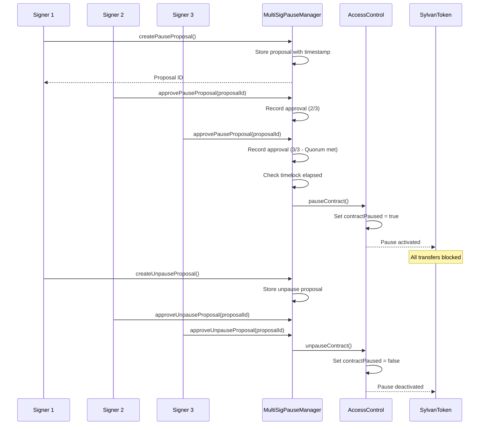

# Design Document: Decentralized Pause Mechanism

## Overview

This design implements a multi-signature pause mechanism to replace the current centralized pause functionality in SylvanToken. The solution addresses security audit finding #3 (Medium severity) by requiring multiple independent approvals before the contract can be paused, eliminating the single point of failure while maintaining emergency response capabilities.

The design introduces a new `MultiSigPauseManager` library that integrates with the existing `AccessControl` library, providing a decentralized governance layer for pause operations while preserving backward compatibility with existing contract functionality.

## Architecture

### High-Level Architecture

```
┌─────────────────────────────────────────────────────────────┐
│                      SylvanToken                            │
│  ┌──────────────────────────────────────────────────────┐  │
│  │         Existing AccessControl Library               │  │
│  │  - contractPaused state                              │  │
│  │  - Basic pause/unpause functions                     │  │
│  └──────────────────────────────────────────────────────┘  │
│                          ↓                                   │
│  ┌──────────────────────────────────────────────────────┐  │
│  │      NEW: MultiSigPauseManager Library               │  │
│  │  - Proposal management                               │  │
│  │  - Signature collection                              │  │
│  │  - Timelock enforcement                              │  │
│  │  - Automatic unpause                                 │  │
│  │  - Signer management                                 │  │
│  └──────────────────────────────────────────────────────┘  │
│                          ↓                                   │
│  ┌──────────────────────────────────────────────────────┐  │
│  │         Transfer Functions (ERC20)                   │  │
│  │  - transfer()                                        │  │
│  │  - transferFrom()                                    │  │
│  │  - Checks pause state before execution              │  │
│  └──────────────────────────────────────────────────────┘  │
└─────────────────────────────────────────────────────────────┘
```

### Component Interaction Flow



## Components and Interfaces

### 1. MultiSigPauseManager Library

**Purpose**: Manages multi-signature proposals for pause/unpause operations with timelock and automatic unpause functionality.

**Key Data Structures**:

```solidity
struct PauseProposal {
    uint256 proposalId;
    ProposalType proposalType;  // PAUSE or UNPAUSE
    uint256 createdAt;
    uint256 executedAt;
    bool executed;
    bool cancelled;
    address proposer;
    address[] approvers;
    mapping(address => bool) hasApproved;
}

struct MultiSigConfig {
    address[] authorizedSigners;
    mapping(address => bool) isAuthorizedSigner;
    uint256 quorumThreshold;
    uint256 timelockDuration;
    uint256 maxPauseDuration;
    uint256 proposalLifetime;
    uint256 proposalCooldown;
    mapping(address => uint256) lastProposalTime;
}

struct PauseState {
    bool isPaused;
    uint256 pausedAt;
    uint256 pauseProposalId;
    uint256 activeProposalCount;
    mapping(uint256 => PauseProposal) proposals;
}

enum ProposalType {
    PAUSE,
    UNPAUSE
}
```

**Core Functions**:

```solidity
// Proposal Management
function createPauseProposal(PauseState storage state, MultiSigConfig storage config, address proposer) external returns (uint256 proposalId);
function createUnpauseProposal(PauseState storage state, MultiSigConfig storage config, address proposer) external returns (uint256 proposalId);
function approvePauseProposal(PauseState storage state, MultiSigConfig storage config, uint256 proposalId, address approver) external;
function executeProposal(PauseState storage state, MultiSigConfig storage config, uint256 proposalId) external returns (bool executed);
function cancelProposal(PauseState storage state, uint256 proposalId, address canceller) external;

// Signer Management
function addAuthorizedSigner(MultiSigConfig storage config, address signer) external;
function removeAuthorizedSigner(MultiSigConfig storage config, PauseState storage state, address signer) external;
function updateQuorumThreshold(MultiSigConfig storage config, PauseState storage state, uint256 newThreshold) external;

// Configuration
function updateTimelockDuration(MultiSigConfig storage config, uint256 newDuration) external;
function updateMaxPauseDuration(MultiSigConfig storage config, uint256 newDuration) external;

// Query Functions
function getProposalStatus(PauseState storage state, uint256 proposalId) external view returns (ProposalStatus memory);
function canExecuteProposal(PauseState storage state, MultiSigConfig storage config, uint256 proposalId) external view returns (bool);
function shouldAutoUnpause(PauseState storage state, MultiSigConfig storage config) external view returns (bool);
function getAuthorizedSigners(MultiSigConfig storage config) external view returns (address[] memory);
```

### 2. Updated AccessControl Integration

The existing `AccessControl` library will be extended to work with the new multi-signature system:

```solidity
// New functions to add to AccessControl
function pauseContractMultiSig(AccessData storage data, address[] memory approvers) external;
function unpauseContractMultiSig(AccessData storage data, address[] memory approvers) external;
function getPauseInfo(AccessData storage data) external view returns (bool isPaused, uint256 pausedAt, uint256 pauseDuration);
```

### 3. SylvanToken Contract Updates

**New State Variables**:
```solidity
using MultiSigPauseManager for MultiSigPauseManager.PauseState;
using MultiSigPauseManager for MultiSigPauseManager.MultiSigConfig;

MultiSigPauseManager.PauseState private pauseState;
MultiSigPauseManager.MultiSigConfig private multiSigConfig;
```

**Modified Functions**:
```solidity
// Replace existing pauseContract() and unpauseContract()
function createPauseProposal() external returns (uint256 proposalId);
function createUnpauseProposal() external returns (uint256 proposalId);
function approvePauseProposal(uint256 proposalId) external;
function executeProposal(uint256 proposalId) external;

// Signer management (owner only)
function addAuthorizedSigner(address signer) external onlyOwner;
function removeAuthorizedSigner(address signer) external onlyOwner;
function updateQuorumThreshold(uint256 newThreshold) external onlyOwner;
```

### 4. Interface: IMultiSigPauseManager

```solidity
interface IMultiSigPauseManager {
    // Proposal management
    function createPauseProposal() external returns (uint256 proposalId);
    function createUnpauseProposal() external returns (uint256 proposalId);
    function approvePauseProposal(uint256 proposalId) external;
    function executeProposal(uint256 proposalId) external;
    function cancelProposal(uint256 proposalId) external;
    
    // Signer management
    function addAuthorizedSigner(address signer) external;
    function removeAuthorizedSigner(address signer) external;
    function getAuthorizedSigners() external view returns (address[] memory);
    function isAuthorizedSigner(address signer) external view returns (bool);
    
    // Configuration
    function updateQuorumThreshold(uint256 newThreshold) external;
    function updateTimelockDuration(uint256 newDuration) external;
    function updateMaxPauseDuration(uint256 newDuration) external;
    function getMultiSigConfig() external view returns (MultiSigConfigView memory);
    
    // Query functions
    function getProposalStatus(uint256 proposalId) external view returns (ProposalStatusView memory);
    function canExecuteProposal(uint256 proposalId) external view returns (bool);
    function shouldAutoUnpause() external view returns (bool);
    function getPauseInfo() external view returns (bool isPaused, uint256 pausedAt, uint256 remainingTime);
    
    // Events
    event PauseProposalCreated(uint256 indexed proposalId, address indexed proposer, uint256 timestamp);
    event UnpauseProposalCreated(uint256 indexed proposalId, address indexed proposer, uint256 timestamp);
    event ProposalApproved(uint256 indexed proposalId, address indexed approver, uint256 approvalCount, uint256 quorumThreshold);
    event ProposalExecuted(uint256 indexed proposalId, ProposalType proposalType, address indexed executor);
    event ProposalCancelled(uint256 indexed proposalId, address indexed canceller, string reason);
    event ContractPausedMultiSig(uint256 indexed proposalId, address[] approvers, uint256 timestamp);
    event ContractUnpausedMultiSig(uint256 indexed proposalId, address[] approvers, uint256 timestamp);
    event AutoUnpauseTriggered(uint256 pauseDuration, uint256 timestamp);
    event AuthorizedSignerAdded(address indexed signer, uint256 totalSigners);
    event AuthorizedSignerRemoved(address indexed signer, uint256 totalSigners);
    event QuorumThresholdUpdated(uint256 oldThreshold, uint256 newThreshold);
    event TimelockDurationUpdated(uint256 oldDuration, uint256 newDuration);
    event MaxPauseDurationUpdated(uint256 oldDuration, uint256 newDuration);
    
    // Errors
    error UnauthorizedSigner(address signer);
    error ProposalNotFound(uint256 proposalId);
    error ProposalAlreadyExecuted(uint256 proposalId);
    error ProposalCancelled(uint256 proposalId);
    error ProposalExpired(uint256 proposalId);
    error TimelockNotElapsed(uint256 proposalId, uint256 remainingTime);
    error QuorumNotMet(uint256 proposalId, uint256 currentApprovals, uint256 required);
    error AlreadyApproved(uint256 proposalId, address signer);
    error InvalidProposalType(uint256 proposalId);
    error ContractAlreadyPaused();
    error ContractNotPaused();
    error ProposalCooldownActive(address signer, uint256 remainingTime);
    error InvalidQuorumThreshold(uint256 threshold, uint256 signerCount);
    error InvalidTimelockDuration(uint256 duration);
    error InvalidMaxPauseDuration(uint256 duration);
    error SignerAlreadyAuthorized(address signer);
    error SignerNotAuthorized(address signer);
    error CannotRemoveLastSigner();
    error InsufficientSignersForQuorum(uint256 signerCount, uint256 quorum);
}
```

## Data Models

### Proposal Lifecycle States

```
┌─────────────┐
│   CREATED   │ ← Proposal created by authorized signer
└──────┬──────┘
       │
       ↓
┌─────────────┐
│  APPROVING  │ ← Collecting signatures from authorized signers
└──────┬──────┘
       │
       ├─→ CANCELLED (if cancelled by proposer or owner)
       │
       ↓
┌─────────────┐
│QUORUM_MET   │ ← Required signatures collected
└──────┬──────┘
       │
       ├─→ EXPIRED (if proposal lifetime exceeded)
       │
       ↓
┌─────────────┐
│TIMELOCK_WAIT│ ← Waiting for timelock period to elapse
└──────┬──────┘
       │
       ↓
┌─────────────┐
│  EXECUTABLE │ ← Ready for execution
└──────┬──────┘
       │
       ↓
┌─────────────┐
│  EXECUTED   │ ← Proposal executed, pause state changed
└─────────────┘
```

### Configuration Constraints

| Parameter | Minimum | Maximum | Default | Description |
|-----------|---------|---------|---------|-------------|
| Quorum Threshold | 2 | 10 | 3 | Minimum signatures required |
| Authorized Signers | 2 | 10 | 5 | Number of addresses that can sign |
| Timelock Duration | 6 hours | 48 hours | 24 hours | Delay before execution |
| Max Pause Duration | 7 days | 30 days | 14 days | Auto-unpause after this time |
| Proposal Lifetime | 7 days | 30 days | 14 days | Proposal expires if not executed |
| Proposal Cooldown | 1 hour | 24 hours | 6 hours | Time between proposals from same signer |

## Correctness Properties

*A property is a characteristic or behavior that should hold true across all valid executions of a system-essentially, a formal statement about what the system should do. Properties serve as the bridge between human-readable specifications and machine-verifiable correctness guarantees.*


### Property Reflection

After analyzing all acceptance criteria, I've identified the following redundancies and consolidations:

**Redundant Properties:**
- 3.1 and 3.3 both test timelock enforcement - can be combined into one property
- 6.1, 6.2, 6.3, 6.4, 6.5 all test event emission - can be combined into a comprehensive event emission property

**Properties to Consolidate:**
- Signer management properties (2.1, 2.2, 2.3, 2.4) can be grouped as they all test signer list invariants
- Configuration validation properties (1.2, 3.2, 4.2) all test parameter bounds - can be unified
- Proposal lifecycle properties (1.1, 1.4, 3.4, 8.5) all relate to proposal state transitions

**Edge Cases to Handle in Generators:**
- 1.5: Contract already paused
- 2.5: Maximum signer limit reached
- These will be covered by property test generators rather than separate properties

After reflection, we have **18 unique correctness properties** that provide comprehensive coverage without redundancy.

### Correctness Properties

Property 1: Quorum enforcement for pause execution
*For any* pause proposal, execution SHALL be blocked until the number of unique approvals reaches the configured quorum threshold AND the timelock period has elapsed
**Validates: Requirements 1.1, 1.4, 3.1, 3.3, 3.4**

Property 2: Approval idempotency
*For any* proposal and any authorized signer, submitting multiple approvals SHALL only count as one approval and subsequent approval attempts SHALL be rejected
**Validates: Requirements 1.3**

Property 3: Configuration parameter bounds
*For any* configuration update (quorum threshold, timelock duration, max pause duration), the system SHALL only accept values within the defined ranges: quorum [2,10], timelock [6h,48h], max pause [7d,30d]
**Validates: Requirements 1.2, 3.2, 4.2**

Property 4: Signer list invariants
*For any* signer management operation (add/remove), the system SHALL maintain these invariants: no zero addresses, no duplicate signers, signer count >= quorum threshold, signer count <= 10
**Validates: Requirements 2.1, 2.2**

Property 5: Signer list query consistency
*For any* sequence of signer additions and removals, querying the authorized signer list SHALL return exactly the set of currently authorized signers with no duplicates or removed signers
**Validates: Requirements 2.4**

Property 6: Pause state validation
*For any* pause proposal creation attempt, if the contract is already paused, the proposal creation SHALL be rejected
**Validates: Requirements 1.5**

Property 7: Emergency bypass requires unanimity
*For any* emergency bypass attempt, execution SHALL only succeed when ALL authorized signers have approved the proposal
**Validates: Requirements 3.5**

Property 8: Automatic unpause after max duration
*For any* paused contract state, if the pause duration exceeds the configured maximum pause duration, the contract SHALL automatically transition to unpaused state
**Validates: Requirements 4.3**

Property 9: Unpause process consistency
*For any* unpause proposal, the approval and execution process SHALL follow the same quorum and timelock requirements as pause proposals
**Validates: Requirements 4.4**

Property 10: Proposal cleanup on unpause
*For any* contract unpause operation, all pending pause proposals SHALL be cleared from the active proposal list
**Validates: Requirements 4.5**

Property 11: Pause timestamp recording
*For any* successful pause execution, the system SHALL record the exact block timestamp of the pause action
**Validates: Requirements 4.1**

Property 12: Deployment parameter validation
*For any* contract deployment, if any constructor parameter is invalid (zero addresses, out-of-range numeric values), the deployment SHALL fail
**Validates: Requirements 5.5**

Property 13: Comprehensive event emission
*For any* state-changing operation (proposal creation, approval, execution, cancellation, pause, unpause, signer changes), the system SHALL emit the corresponding event with all required parameters
**Validates: Requirements 6.1, 6.2, 6.3, 6.4, 6.5, 2.3**

Property 14: Transfer blocking during pause
*For any* token transfer attempt (transfer or transferFrom) while the contract is paused, the transaction SHALL revert with a clear error message
**Validates: Requirements 7.2**

Property 15: Administrative function exemption
*For any* administrative function call (vesting releases, fee management, signer management) while the contract is paused, the function SHALL execute successfully
**Validates: Requirements 7.3**

Property 16: Pause state query accuracy
*For any* pause state query, the returned values (isPaused, pausedAt, remainingTime) SHALL accurately reflect the current contract state
**Validates: Requirements 7.4**

Property 17: Proposal cooldown enforcement
*For any* authorized signer, creating a new proposal within the cooldown period after their last proposal SHALL be rejected
**Validates: Requirements 8.1**

Property 18: Proposal ID uniqueness
*For any* two proposals, they SHALL have unique proposal IDs that cannot be reused or replayed
**Validates: Requirements 8.2**

Property 19: Quorum change invalidates pending proposals
*For any* quorum threshold modification, all pending proposals that have not been executed SHALL be invalidated
**Validates: Requirements 8.3**

Property 20: Signer removal updates proposals
*For any* signer removal, if that signer has approved any pending proposals, their approvals SHALL be removed from those proposals and the approval count SHALL be decremented
**Validates: Requirements 8.4**

Property 21: Proposal expiration enforcement
*For any* proposal execution attempt, if the proposal age exceeds the maximum proposal lifetime, the execution SHALL be rejected
**Validates: Requirements 8.5**

Property 22: Backward compatibility preservation
*For any* token transfer operation when the contract is not paused, the transfer SHALL execute with the same behavior as before the multi-signature mechanism was added
**Validates: Requirements 7.1**

## Error Handling

### Error Categories

**1. Authorization Errors**
- `UnauthorizedSigner(address signer)`: Caller is not an authorized signer
- `SignerAlreadyAuthorized(address signer)`: Attempting to add a signer that already exists
- `SignerNotAuthorized(address signer)`: Attempting to remove a signer that doesn't exist
- `CannotRemoveLastSigner()`: Attempting to remove the last signer

**2. Proposal State Errors**
- `ProposalNotFound(uint256 proposalId)`: Proposal ID doesn't exist
- `ProposalAlreadyExecuted(uint256 proposalId)`: Attempting to interact with an executed proposal
- `ProposalCancelled(uint256 proposalId)`: Attempting to interact with a cancelled proposal
- `ProposalExpired(uint256 proposalId)`: Proposal lifetime exceeded
- `InvalidProposalType(uint256 proposalId)`: Proposal type doesn't match expected type

**3. Timing Errors**
- `TimelockNotElapsed(uint256 proposalId, uint256 remainingTime)`: Attempting execution before timelock expires
- `ProposalCooldownActive(address signer, uint256 remainingTime)`: Signer attempting to create proposal during cooldown

**4. Quorum Errors**
- `QuorumNotMet(uint256 proposalId, uint256 currentApprovals, uint256 required)`: Insufficient approvals for execution
- `AlreadyApproved(uint256 proposalId, address signer)`: Signer attempting to approve twice
- `InvalidQuorumThreshold(uint256 threshold, uint256 signerCount)`: Quorum exceeds signer count
- `InsufficientSignersForQuorum(uint256 signerCount, uint256 quorum)`: Not enough signers to meet quorum

**5. State Errors**
- `ContractAlreadyPaused()`: Attempting to pause when already paused
- `ContractNotPaused()`: Attempting to unpause when not paused

**6. Configuration Errors**
- `InvalidTimelockDuration(uint256 duration)`: Timelock outside [6h, 48h] range
- `InvalidMaxPauseDuration(uint256 duration)`: Max pause duration outside [7d, 30d] range

### Error Handling Strategy

**Fail-Fast Principle**: All validation errors should revert immediately with descriptive error messages. No partial state changes should occur.

**State Consistency**: If any operation fails, the contract state must remain unchanged (atomic operations).

**Event Emission**: Even failed operations should be logged for transparency (where gas-efficient).

**Recovery Mechanisms**:
- Expired proposals can be cleaned up by anyone
- Auto-unpause provides recovery from indefinite pause
- Owner can cancel malicious proposals
- Quorum can be adjusted if signers become unavailable

## Testing Strategy

### Unit Testing Approach

**Test Categories**:

1. **Proposal Lifecycle Tests**
   - Create pause/unpause proposals
   - Approve proposals with various signer combinations
   - Execute proposals after timelock
   - Cancel proposals
   - Handle expired proposals

2. **Signer Management Tests**
   - Add/remove signers
   - Update quorum threshold
   - Validate signer constraints
   - Test edge cases (max signers, min signers)

3. **Timelock Tests**
   - Verify timelock enforcement
   - Test emergency bypass with unanimous approval
   - Validate timelock configuration bounds

4. **Auto-Unpause Tests**
   - Verify automatic unpause after max duration
   - Test pause duration tracking
   - Validate max duration configuration

5. **Integration Tests**
   - Test pause/unpause with actual token transfers
   - Verify admin functions work during pause
   - Test interaction with existing AccessControl library

6. **Security Tests**
   - Replay attack prevention
   - Cooldown enforcement
   - Proposal spam prevention
   - Quorum manipulation attempts

### Property-Based Testing Approach

**PBT Library**: We will use **Foundry's property testing** (built on top of Echidna/Medusa) for Solidity property-based testing.

**Configuration**: Each property test will run a minimum of **100 iterations** with randomized inputs.

**Test Tagging**: Each property-based test will be tagged with the format:
`**Feature: decentralized-pause-mechanism, Property {number}: {property_text}**`

**Property Test Implementation**:

1. **Generators**:
   - Random signer addresses (2-10 signers)
   - Random quorum thresholds (2 to signer count)
   - Random timelock durations (6-48 hours)
   - Random proposal sequences
   - Random time advances

2. **Invariants to Test**:
   - Quorum enforcement (Property 1)
   - Approval idempotency (Property 2)
   - Configuration bounds (Property 3)
   - Signer list consistency (Properties 4, 5)
   - Pause state validation (Property 6)
   - Automatic unpause (Property 8)
   - Event emission (Property 13)
   - Transfer blocking (Property 14)
   - Proposal expiration (Property 21)

3. **State Machine Testing**:
   - Model proposal lifecycle as a state machine
   - Generate random sequences of operations
   - Verify state transitions are valid
   - Check invariants hold after each operation

**Example Property Test Structure**:

```solidity
// **Feature: decentralized-pause-mechanism, Property 1: Quorum enforcement for pause execution**
function testProperty_QuorumEnforcement(
    uint8 signerCount,
    uint8 quorumThreshold,
    uint8 approvalCount
) public {
    // Bound inputs
    signerCount = uint8(bound(signerCount, 2, 10));
    quorumThreshold = uint8(bound(quorumThreshold, 2, signerCount));
    approvalCount = uint8(bound(approvalCount, 0, signerCount));
    
    // Setup signers
    address[] memory signers = _generateSigners(signerCount);
    _setupMultiSig(signers, quorumThreshold);
    
    // Create proposal
    uint256 proposalId = _createPauseProposal(signers[0]);
    
    // Collect approvals
    for (uint256 i = 0; i < approvalCount && i < signerCount; i++) {
        _approveProposal(proposalId, signers[i]);
    }
    
    // Advance time past timelock
    vm.warp(block.timestamp + 24 hours + 1);
    
    // Verify execution behavior
    if (approvalCount >= quorumThreshold) {
        // Should succeed
        _executeProposal(proposalId);
        assertTrue(token.isPaused());
    } else {
        // Should fail
        vm.expectRevert(abi.encodeWithSelector(
            IMultiSigPauseManager.QuorumNotMet.selector,
            proposalId,
            approvalCount,
            quorumThreshold
        ));
        _executeProposal(proposalId);
    }
}
```

### Test Coverage Goals

- **Line Coverage**: 95%+
- **Branch Coverage**: 90%+
- **Function Coverage**: 100%
- **Property Tests**: All 22 properties implemented
- **Unit Tests**: Minimum 50 unit tests covering edge cases and examples

### Testing Tools

- **Foundry**: Primary testing framework
- **Forge**: Test runner and property testing
- **Echidna/Medusa**: Advanced fuzzing (optional)
- **Slither**: Static analysis for security issues
- **Hardhat**: Integration testing with existing test suite

## Implementation Notes

### Gas Optimization Considerations

1. **Storage Layout**: Pack related variables to minimize storage slots
2. **Approval Tracking**: Use bitmap for approval tracking instead of array iteration
3. **Proposal Cleanup**: Implement lazy deletion for expired proposals
4. **Event Emission**: Emit indexed parameters for efficient filtering

### Security Considerations

1. **Reentrancy**: All state changes before external calls
2. **Integer Overflow**: Use Solidity 0.8.24 built-in overflow protection
3. **Access Control**: Strict validation of authorized signers
4. **Time Manipulation**: Use block.timestamp carefully, aware of miner manipulation limits
5. **Proposal ID Generation**: Use counter + hash to prevent collisions

### Backward Compatibility

1. **Existing Functions**: Keep old `pauseContract()` and `unpauseContract()` as deprecated but functional for emergency
2. **Events**: Maintain existing pause/unpause events
3. **State Variables**: Reuse `contractPaused` from AccessControl library
4. **Migration Path**: Provide upgrade script to transition from single-owner to multi-sig

### Deployment Strategy

1. **Phase 1**: Deploy new library and test on testnet
2. **Phase 2**: Upgrade main contract to include multi-sig (testnet)
3. **Phase 3**: Configure initial signers and quorum
4. **Phase 4**: Audit and security review
5. **Phase 5**: Mainnet deployment with timelock
6. **Phase 6**: Transfer ownership to multi-sig or DAO

## Future Enhancements

1. **DAO Integration**: Replace multi-sig with on-chain governance
2. **Weighted Voting**: Different signers have different voting power
3. **Proposal Types**: Add more proposal types (fee changes, parameter updates)
4. **Delegation**: Allow signers to delegate their voting power
5. **Snapshot Integration**: Off-chain voting with on-chain execution
6. **Emergency Contacts**: Automated alerts when proposals are created
